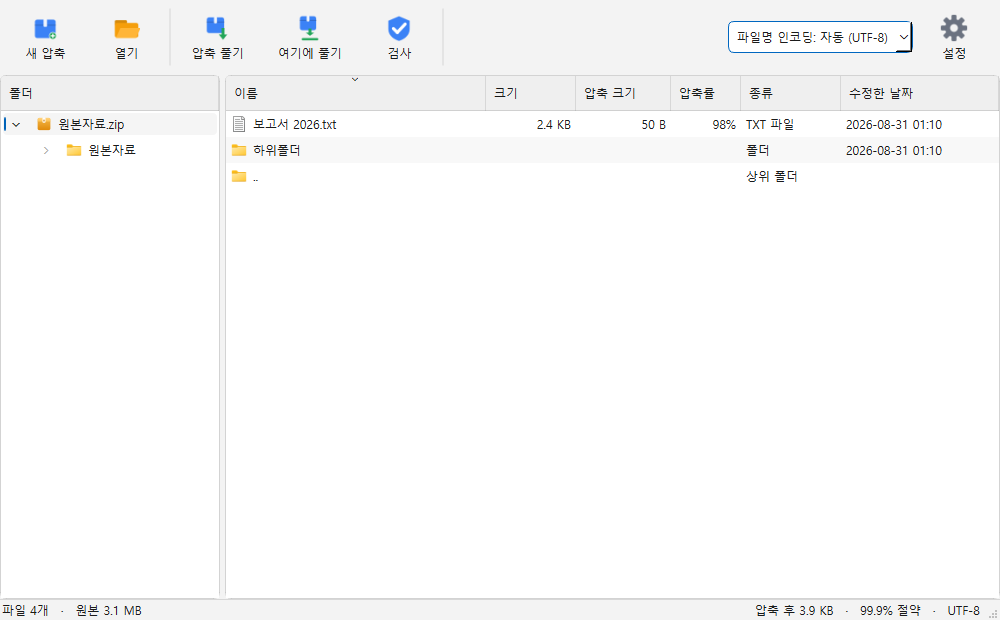
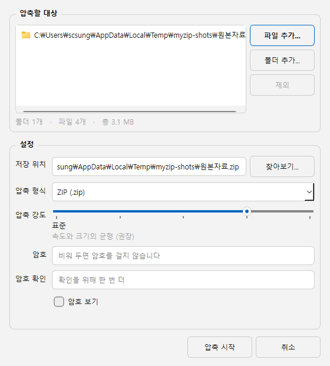
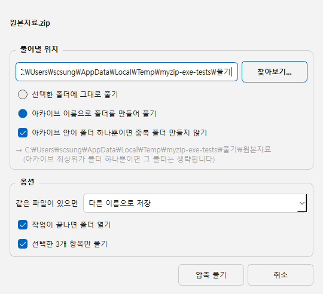
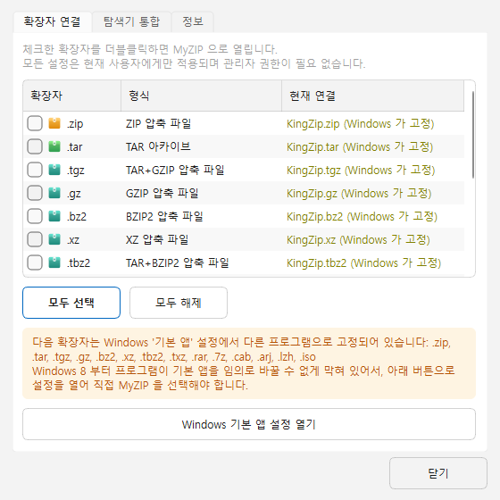
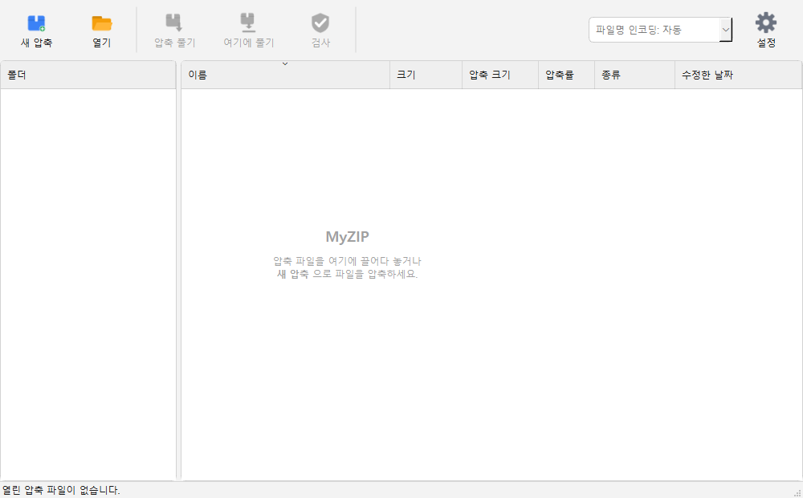

<div align="center">


# MyZIP

**반디집 / KingZip 스타일의 가벼운 Windows 압축 프로그램**

[](https://github.com/saintsc-ai/MyZIP/actions/workflows/tests.yml)
[](LICENSE)
[](https://www.python.org)

[다운로드](https://github.com/saintsc-ai/MyZIP/releases) ·
[사용법](docs/사용법.md)

</div>

---



## 무엇을 하는가

| 형식 | 압축 | 해제 |
| --- | :---: | :---: |
| ZIP (AES-256 암호) | ✅ | ✅ |
| TAR | ✅ | ✅ |
| TAR.GZ / TGZ | ✅ | ✅ |
| TAR.BZ2 / TAR.XZ | ✅ | ✅ |
| GZ / BZ2 / XZ (단일 파일) | — | ✅ |
| RAR (RAR4 / RAR5) | ❌ | ✅ |
| 7Z, CAB, ARJ, LZH, ISO | ❌ | ✅ |

> **RAR 압축이 없는 이유**: RAR 은 RARLAB 의 독점 형식이고, unRAR 라이선스가
> 그 코드를 RAR 압축기 제작에 쓰는 것을 명시적으로 금지합니다.
> 7-Zip 과 반디집도 같은 이유로 RAR 은 해제만 지원합니다.

## 핵심 기능

- **탐색기 우클릭 메뉴** — 압축하기 / 여기에 압축 풀기 / 폴더 생성 후 풀기 / 무결성 검사.
  기본 연결 프로그램이 MyZIP 이 아니어도 나옵니다.
- **한글 파일명 자동 복원** — UTF-8 / CP949 / CP932 / GBK 를 아카이브 단위로 판별합니다.
  깨져 보이면 툴바에서 직접 고를 수도 있습니다.
- **풀지 않고 들여다보기** — 폴더 트리로 아카이브 안을 돌아다니고,
  파일을 더블클릭하면 임시 폴더로 꺼내 바로 엽니다.
- **경로 탈출 차단** — `../../windows/system32` 같은 악성 경로를 무력화합니다.
- **관리자 권한 불필요** — 레지스트리는 `HKEY_CURRENT_USER` 에만 씁니다.
  제거하면 확장자 연결이 이전 프로그램으로 되돌아갑니다.
- **취소 가능한 진행 표시** — 남은 시간 추정 포함. 취소해도 반쪽짜리 파일이 남지 않습니다.

## 설치

[Releases](https://github.com/saintsc-ai/MyZIP/releases) 에서 받으세요.

| 파일 | 설명 |
| --- | --- |
| `MyZIP-x.y.z-setup.exe` | 설치 마법사. UAC 창 없이 사용자 폴더에 설치됩니다 |
| `MyZIP-x.y.z-portable.zip` | 압축만 풀면 바로 실행. 설치 없음 |

포터블은 탐색기 통합을 쓰려면 한 번만 `MyZIP.exe --register` 를 실행하세요.

> **Windows 11 참고**: 우클릭 메뉴는 **'추가 옵션 표시'**(`Shift`+`F10`) 안에
> 나타납니다. 1차 메뉴에 넣으려면 MSIX 패키지와 서명된 COM 확장이 필요한데,
> 이 프로젝트는 그 복잡도를 택하지 않았습니다.

자세한 사용법은 **[docs/사용법.md](docs/사용법.md)** 를 보세요.

## 화면

<table>
<tr>
<td width="50%"><br><sub>압축하기 — 형식·강도·AES-256 암호</sub></td>
<td width="50%"><br><sub>압축 풀기 — 중복 폴더 방지, 충돌 처리</sub></td>
</tr>
<tr>
<td><br><sub>설정 — 확장자 연결 상태를 함께 표시</sub></td>
<td><br><sub>드래그 앤 드롭으로 열거나 압축</sub></td>
</tr>
</table>

## 소스에서 실행

```bash
pip install -r requirements.txt

python tools/make_icons.py         # 아이콘 생성
python tools/make_action_icons.py
python tools/fetch_7zip.py         # RAR/7Z 해제 엔진 (선택)

python myzip_app.py                # 실행
python myzip_app.py --register     # 확장자 연결 + 우클릭 메뉴 등록
python myzip_app.py --unregister   # 해제
```

## 빌드

```bash
python build.py --release
```

`release/` 에 설치본, 포터블 ZIP, `SHA256SUMS.txt` 가 만들어집니다.
설치 파일을 만들려면 Inno Setup 6 이 필요합니다:
`winget install JRSoftware.InnoSetup`

| 명령 | 결과 |
| --- | --- |
| `python build.py` | `dist/MyZIP/` 폴더 |
| `python build.py --installer` | 위 + 설치 마법사 |
| `python build.py --release` | 처음부터 다시 빌드 + 포터블 + 체크섬 |
| `python build.py --clean` | 산출물 정리 |

포터블 ZIP 은 MyZIP 자신의 압축 코드로 묶습니다.
릴리스할 때마다 83 MB / 229개 파일이라는 실제 데이터로
압축 경로가 한 번 더 검증되는 셈입니다.

## 테스트

```bash
python tests/test_core.py       # 왕복, CP949, 경로 탈출, 암호, 취소, 단일 gz
python tests/test_rar.py        # RAR / 7Z 해제, 헤더 암호화
python tests/test_cli.py        # 컨텍스트 메뉴가 부르는 명령들
python tests/test_built_exe.py  # 빌드된 exe (build.py 먼저 실행)
```

작업 폴더는 시스템 임시 폴더를 쓰며 `MYZIP_TEST_DIR` 로 바꿀 수 있습니다.

RAR 은 압축기를 만들 수 없으니 테스트 파일도 만들 수 없습니다.
그래서 문서화된 헤더 구조로 무압축 RAR4 컨테이너를 직접 조립해
([tests/rar_fixture.py](tests/rar_fixture.py)) 실제 해제를 검증합니다.

## 구조

```text
myzip/
  core/             포맷 처리 — UI 의존성 없음
    base.py           ArchiveReader/Writer 인터페이스, 진행률, 취소
    zip_handler.py    ZIP (pyzipper, AES-256)
    tar_handler.py    TAR / GZ / BZ2 / XZ, 단일 압축 파일
    rar_handler.py    RAR · 7Z (7z.exe 엔진)
    sevenzip.py       7z.exe 래퍼
    encoding.py       파일명 인코딩 자동 판별
    path_safety.py    경로 탈출 차단
    formats.py        매직 바이트 판별, 핸들러 선택
  ui/               PySide6 화면
  shell/            레지스트리 — 확장자 연결, 컨텍스트 메뉴
  app.py            부트스트랩, 단일 인스턴스, 동작 라우팅
  cli.py            명령줄 파싱
tools/              아이콘 생성, 7-Zip 준비, 스크린샷
tests/              자동 검증
installer/          Inno Setup 스크립트
```

## 라이선스

소스 코드는 [MIT](LICENSE).
배포판에 함께 들어가는 PySide6(LGPL v3), 7-Zip(LGPL + unRAR 제한)에 대해서는
[THIRD-PARTY-NOTICES.md](THIRD-PARTY-NOTICES.md) 를 참고하세요.
